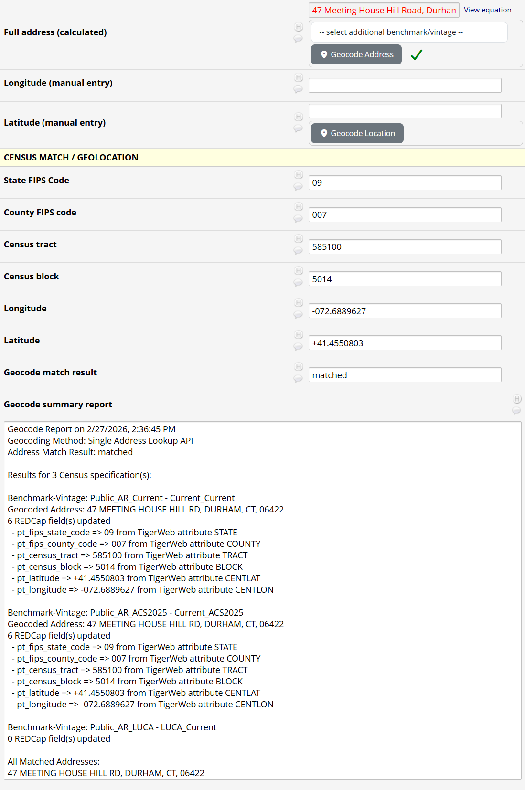

# Census Geocoder External Module
The Census Geocoder's main function is to map REDCap address or location data onto user-selectable Census geocode attributes. These include the FIPS codes for block, tract, county and state; as well as other geographic (TigerWeb) attribute values.

February 2026

## Project Configuration

> **Note: All REDCap fields in the following settings must be located on the same form.**  

### Address and location fields

These REDCap fields will be used in the Census geocode API calls to fetch geocoding data. If an address match fails or an address is not available, a match by location (latitude and longitude) can be attempted. 

- **Field Containing the Full Address**: The field containing the address for which you wish to receive US Census data. If this is a calculated field, you should enable **Require user to initiate geocoding by clicking a button**, below.

- **Fields Containing the Latitude/Longitude (if address not found)**: These fields are most useful when populated by the [Address Autocomplete External Module](https://github.com/vanderbilt-redcap/address-autocomplete).  

### User Interface Options  

By default, Census Geocoder is passive, reacting to data entry 'change' events on the form containing the fields to be geocoded. Census Geocoder also supports a mode that requires the user to initiate geocoding by clicking a button. This may be optimal for projects enabling this EM after a substantial amount of data entry has transpired, or when the address is stored in a calculated field (in which case the data entry change event will not be fired). You may also enable a dropdown from which the user may select additional benchmark-vintage combinations to be processed along with (after) the configured combinations. User-selected benchmark-vintage combinations inherit the superset of field mappings over all configured combinations.

- **Require user to initiate geocoding by clicking a button** By default, geocoding will occur in real time as data (address, latitude, longitude) are entered or edited. You may elect to to trigger geocoding manually using a button instead. If you specify both address and location (latitude/longitude) fields, separate buttons will be added for each geocoding method.  

- **Allow user selection of additional benchmark-vintages** You allow the user to select additional benchmark-vintage combinations to process in addition to the configured combinations. Each additional benchmark-vintage combination is selected from a dropdown inserted after the address field on the REDCap form, for which the already-selected (or configured) combinations are distinguished from the additional, selectable combinations.

### Census Benchmarks and Geocode Field Mapping  

You may select any number of Census Benchmark-Vintage combinations from which to geocode your data. 
For each benchmark-vintage combination, you specify:

- **Benchmark - Vintage**: The Benchmark and Vintage from which you wish to receive data. Only currently supported combinations are listed. The list of valid benchmark-vintage combinations is updated weekly from the online Census database. Note that options containing "Current" are subject to flux and are typically not recommended to be used.  

    - "Benchmark" refers to the time period when the address range was captured in TIGER, "Vintage" is the date when the geography information was captured. For more information see [the official FAQ](https://www2.census.gov/geo/pdfs/maps-data/data/FAQ_for_Census_Bureau_Public_Geocoder.pdf).  

- **Field Mappings**  A list of ```TigerWeb data keys``` and ```REDCap field names```, as follows:

    - **Data Key from TigerWeb Available Fields**: The attribute which you wish to receive from the US Census API.
        - Associated fields will receive the value associated with the smallest geographic region (ordered by land area) in which the specified attribute appears; please be aware that not every key listed here is guaranteed to appear for every address in every **Benchmark - Vintage**.  

        - See [TigerWeb](https://tigerweb.geo.census.gov/tigerwebmain/TIGERweb_attribute_glossary.html?) documentation for descriptions of these attributes.  

    - **Field to Populate with Corresponding Data Key**: The REDCap field to populate with the specified **Data Key from TigerWeb Available Fields**.

### Optional Geocoding Summary Fields  

Implementing these optional fields will allow you to track geocoding results, and will help resolve address match failures.

- **Optional text field to populate with a geocoding match result.** A REDCap field to store a result code for the match result. 
Possible values are ```matched```,  ```not matched``` and ```multiple matches```. A result of ```multiple matches``` means that the provided
address was matched to more than one distinct geocoded address.  

- **Optional notes/paragraph field to populate with a geocoding summary report.** A REDCap field to store a brief report summarizing the match.  

The summary report will include:  

   - Date and time of the API call,
   - The match result (matched/not matched/multiple matches),
   - A list of all distinct matched addresses, within each Census benchmark-vintage and across all benchmark-vintages.  
   - For each benchmark-vintage combination:
     - The Benchmark and Vintage
     - The geocoded address
     - The number of geocode fields that were populated
  
## Screen shot  

The following screen shot includes REDCap fields populated with requested geographic attribute values, as well as the match result and the geocode summary report.

